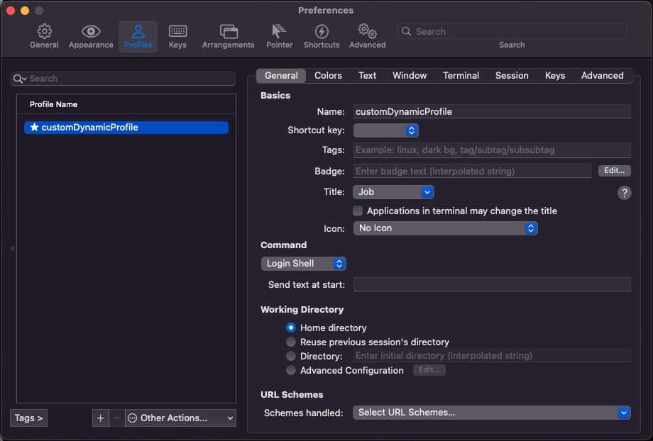

# Liveonit Dotfiles

## Requirements

This automated setup was tested on ubuntu 22.04 with CPU amd64 and on MacOS Monterey Version 12.4 with Apple M1 CPU.
The operating system needs to have installed git to clone this project.

## Run

Clone this repo on your home or projects folder and move to the root dir of this project. Once you are there, you should change the `remote_user` on `ansible/setup_mac.yml` or `ansible/setup_ubuntu.yml` depending on your `OS`.  

```yaml
- hosts: localhost
  become: yes
  remote_user: liveofit # <<<==== You should set the name of your user
```

And then just run

```bash
./install.sh   
```

## Post Install

To get all the `iterm2` configuration, after the installation it's necessary to go to the `iterm2` Preferences (shortcut `CMD + ,`) and then go to Profile section, on this section select the `customDynamicProfile`



As plus you can open VIM and at the first start it should load nvim-treesitter languages and everything should be working fine, if you have some problem you can execute mannually the `:PlugInstall` (to install plugins) command or `:healthcheck` (to check the vim status).
